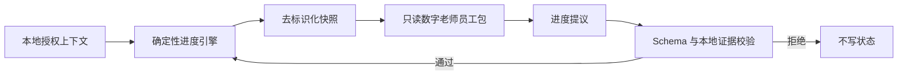

# 系统架构设计师过线私教

一个独立、可移植的本地数字老师：记得你真实做过什么，优先补最可能拖到 45 分以下的短板，并把每日任务压缩到最多 3 项。目标是稳定过线，不追求无止境刷高分。

> 当前状态：本地 vertical slice，尚未上线。多用户账号、云端同步和托管服务尚未实现；当前版本不会上传用户问题或学习状态，也没有启用模型运行。

本项目把两类公开能力组合起来：

- [senior-software-architect-review](https://github.com/PeterGuy326/senior-software-architect-review) 提供公开复习资料，由使用者单独 clone；
- [Digital Employee](https://github.com/fullstack-ai-infra/digital-employee) `0.3.0` 提供可移植员工包契约、静态校验与离线评测。

复习资料和私人进度彼此分离。公开资料可以更新和共享；个人档案、作答记录、错题证据始终保存在操作系统的用户数据目录中。

截至本项目建立时，上述复习资料仓库没有声明 LICENSE。本仓库因此不复制或再分发其中的题库、解析和范文，只接受用户自行提供的本地 clone。这里的 Apache-2.0 只覆盖本仓库代码和原创文档，不自动覆盖外部资料。详见 [来源说明](docs/PROVENANCE.md)。

## 已经能做什么

- `setup`：在仓库外建立本地私人档案与授权上下文；
- `status`：显示综合、案例、论文三科的真实证据状态；
- `today`：按过线优先算法给出最多 3 个任务；
- `doctor`：匿名时只做通用诊断，授权后才检查私人状态；
- `validate-package`：用 Digital Employee 做员工包静态校验；
- `eval-package`：运行员工包离线 fixture 评测，不调用模型；
- 严格验证智能体的进度提议，并只用本地可信作答证据写入确定性进度引擎。

`run` 是为后续本地 Agent Host 留出的入口，目前会明确返回“尚未启用”。Digital Employee `0.3.0` 中 Codex 仍是 **probe-only**：可以探测兼容性，但本项目不会把它当作可运行 Adapter。

## 快速开始

需要 Node.js 20+ 和 Python 3。

```bash
git clone https://github.com/PeterGuy326/senior-software-architect-review.git
git clone https://github.com/PeterGuy326/senior-architect-pass-coach.git
cd senior-architect-pass-coach
npm install

npm run coach -- setup \
  --content-dir ../senior-software-architect-review \
  --exam-date 2026-11-07 \
  --daily-minutes 45

npm run coach -- status --json
npm run coach -- today
npm run coach -- doctor
```

如果不传 `--data-dir`，私人数据默认保存在：

- macOS：`~/Library/Application Support/senior-architect-pass-coach`
- Linux：`$XDG_DATA_HOME/senior-architect-pass-coach`，或 `~/.local/share/...`
- Windows：`%LOCALAPPDATA%/senior-architect-pass-coach`

Workbench 会拒绝把私人数据目录设在代码仓库内，即使该目录已经写进 `.gitignore`。

## 员工包检查

```bash
npm run coach -- validate-package
npm run coach -- eval-package

# 只探测 Codex 本机兼容性；不会调用模型
npm run coach -- validate-package --engine codex
```

静态校验与离线评测不会发起模型调用。安装 npm 依赖本身仍会访问配置的 npm registry。

## 信任边界



智能体永远只能“提议”。外层 Workbench 会先验证输出结构、授权范围和本地可信证据，再调用进度引擎写入。模型提供的用户身份、路径或“已经写入”声明一律不可信。

更完整的说明见 [架构](docs/ARCHITECTURE.md) 与 [隐私边界](docs/PRIVACY.md)。

## 开发

```bash
npm run check
```

本项目采用 [Apache License 2.0](LICENSE)。Digital Employee 是独立依赖，其归属见 [NOTICE](NOTICE)。
