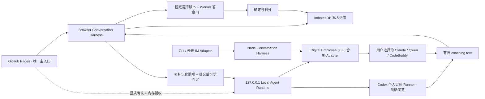

# 系统架构设计师过线私教

一个由本机 Agent 驱动的私人数字老师：记得你真实做过什么，优先补最可能拖到 45 分以下的短板，并把每日任务压缩到最多 3 项。目标是稳定过线，不追求无止境刷高分。

## 直接使用

**[打开「架构过线私塾」](https://peterguy326.github.io/senior-architect-pass-coach/)**

Pages 不提供浏览器伪 Chatbot，也不会把固定模板冒充成 Agent。开始建档、恢复档案、出题、判分、查看进度或对话前，必须先连接 Local Agent Runtime，并选择一个实际通过本机检查的 Agent。考生不需要 clone 仓库、安装 Node/Python 或编译源码，但需要从 Release 下载并启动 Runtime；页面不会收集 API Key。

当前网页 MVP 先把最适合确定性闭环的**综合知识客观题**做好：每天最多 3 项。考生只需作答，私教先按题目长短与复杂度计算参考用时，再用“前台有效做题时间 ÷ 参考用时”作为自动判断的主要行为信号；首次选择过早、真实改选、过快、过慢或计时中断都会进入复测，不会被一次作答冒认成已掌握。案例分析和论文会显示为“未测量”，不会假装已经支持。

> 当前状态：这个 GitHub Pages 页面是唯一的考生主入口，但本机 Agent 是进入私教流程的硬门槛。学习档案、选题、可信判分和进度仍由该 Pages Origin 的浏览器 Harness 统一保管；Digital Employee `0.3.0` 运行用户明确选择的兼容 Agent。页面一旦在下一次交互中检测到 Runtime 连接或授权失效，就会锁回连接页，不会降级成浏览器聊天，也不会删除已经原子提交到 IndexedDB 的进度。重新连接后可继续使用同一份本地档案。

## 连接本机 Agent

从 [v0.7.0-preview.2 Release](https://github.com/PeterGuy326/senior-architect-pass-coach/releases/tag/runtime-v0.7.0-preview.2) 下载对应系统的 **Local Agent Runtime**：

1. macOS 下载 Apple Silicon 或 Intel 的应用包，解压后打开“架构过线私教”；Linux x64（glibc 2.28+）解压后运行 `start-local-coach`。需要核验下载完整性时，对照同一 Release 的 `SHA256SUMS`。
2. macOS 首次解压后打开一次 `.app`，让系统登记 `senior-architect-pass-coach://` 启动入口；Runtime 仍只在 `127.0.0.1:43127` 启动配对桥。这个入口只负责启动应用，不接收令牌、命令、文件路径或网页参数。
3. 在 Pages 的私教大脑面板里直接点击 `Codex CLI`、`Claude Code`、`Qwen Code` 或 `CodeBuddy Code`。网页会检测 Runtime；macOS 未运行时会尝试唤起已安装应用，Linux 则需先运行 `start-local-coach`。确认并验证目标 Agent 可用后，页面会自动选择它、关闭面板并进入对话；不会偷偷改选其他模型。
4. Runtime 会先密封一份只读 Digital Employee 员工工作区，并把员工名、版本和摘要绑定到本次会话；探测、Schema 校验和实际执行都使用这一份工作区。
5. Runtime 只会激活你点击的那个引擎；它不可用时页面保持锁定，并提示重试或改选，不会改选其他“大脑”，也不会启动 `content-only` 后备聊天。选择 Codex 时还会出现一次明确的个人模式授权；可信判分仍先在 Pages 的浏览器本地完成，Agent 只负责个性化讲解。

这是“下载应用并打开”，不是 clone 仓库、安装 npm 依赖或本地编译。当前预览包尚未做 Apple notarization；ad-hoc 签名只用于完整性检查，不代表 Developer ID 或 Apple 背书。macOS 首次打开可先在 Finder 中右键选择“打开”；若仍被拦，请先尝试启动一次，再到“系统设置 → 隐私与安全 → 仍要打开”，详见 [Apple 官方说明](https://support.apple.com/102445)。Pages 在加载时不会扫描本机端口；只有点击连接后才访问固定的 loopback 地址并请求浏览器许可。

桌面 Chrome/Edge 是当前 Agent 配对主路径；首次从网页唤起时，浏览器可能询问是否允许打开“架构过线私教”，随后还可能显示本地网络访问许可。拒绝后页面保持在连接门，不会恢复档案、出题或提供浏览器聊天。Safari、Firefox 或受管浏览器若阻止 custom scheme、弹窗或公开 HTTPS 页面访问本机 HTTP loopback，会给出安装/启动诊断；手机上的 `127.0.0.1` 指向手机自身，不能连接电脑上的 Runtime，因此当前移动端无法进入私教流程。项目不会为了绕过这些限制而监听局域网地址。已有浏览器档案不会因连接失败而被改写或删除。

配对窗口与 Pages 虽然是两个 Origin，但它只负责确认授权，不保存也不迁移学习档案。短期 Bearer 通过精确来源校验的 `postMessage` 交给原 Pages 页面，随后仅留在 JavaScript 私有内存；题目、作答和进度仍在原 Pages Origin 的 IndexedDB，所以不再需要在两个页面之间导出、导入或合并档案。

Digital Employee 当前的真实兼容边界如下：

| 引擎 | 当前状态 | 说明 |
|---|---|---|
| Claude Code | 可运行 Adapter | 需要兼容版本和 Runtime 进程可见的 `ANTHROPIC_API_KEY` |
| Qwen Code | 可运行 Adapter | 需要 `0.17.1`、`OPENAI_API_KEY` 与 `OPENAI_MODEL` |
| CodeBuddy | 可运行 Adapter | 需要 `2.106.4`、`CODEBUDDY_API_KEY` 与 `CODEBUDDY_MODEL` |
| Qoder | 不兼容 | 当前 Adapter 不支持本员工包要求的结构化输出 |
| Codex | 本机个人实验模式 | Digital Employee `0.3.0` 仍是 probe-only；当前仅开放已审计的 Codex CLI `0.146.0`，Runtime 检测到该版本与本机登录后，经本人再次同意，可用一次性 `codex exec` 补充讲解 |
| Hermes Agent（Nous Research） | 仅探测 | 当前只检查 `hermes --version`；执行 Adapter 尚未实现，不能选择 |

页面不会要求、接收或保存模型 API Key。Claude、Qwen 与 CodeBuddy 由 Runtime 启动时的本机环境提供对应服务凭证；合格框架 Adapter 不会冒充复用个人 CLI 登录态。Codex 是单独标注的案例级个人实验路径：只在用户明确同意后复用本机已有的 Codex / ChatGPT 登录，授权仅绑定当前 Runtime 内存，不会把它冒充成 Digital Employee 合格 Adapter。

本项目把两类公开能力组合起来：

- [senior-software-architect-review](https://github.com/PeterGuy326/senior-software-architect-review) 提供公开复习资料；网页会从固定审阅 commit 直接读取，考生无需 clone；
- [Digital Employee](https://github.com/fullstack-ai-infra/digital-employee) `0.3.0` 提供可移植员工包契约、静态校验与离线评测。

复习资料和私人进度彼此分离。网页端的个人档案与作答证据只保存在当前浏览器的 IndexedDB；CLI 端保存在操作系统的用户数据目录。两者默认都不上传。

截至本项目建立时，上述复习资料仓库没有声明 LICENSE。本仓库因此不把其中的题库、解析和范文复制进网页、npm 包或测试；网页只在用户浏览器运行时从固定来源读取，CLI 则读取用户自行取得的 clone。这里的 Apache-2.0 只覆盖本仓库代码和原创文档，不自动覆盖外部资料。详见 [来源说明](docs/PROVENANCE.md)。

## 已经能做什么

- 连接并选择本机 Agent 后，在同一个 Pages 页面输入“今天学什么”“查看进度”“继续”“出题”，或直接提交 A–H 单选/多选答案，并可向所选 Agent 自然语言追问；
- Agent 调用会立即出现一张可验证的执行笺，按真实边界展示“准备允许字段 / 固定判分 / 原子提交 / 等待 Runtime / 校验输出”等过程和实际耗时；不会展示模型内部思维链、provider 原始事件或虚构进度百分比；
- Codex 连接后只展示本机 CLI 当次实际核验可用的“轻量 / 快速 / 均衡 / 深入”档位；网页只提交档位 ID，Runner 会在每轮紧邻执行时认证一次 exact model 与 reasoning effort，切换仅对下一轮生效；
- 客观题反馈后，Harness 会根据真实时间、改选和复测原因主动问一条有界问题；提议不会自动调用模型或写进度。对话框支持 Enter 发送、Shift+Enter 换行及中文输入法组合态防误发；
- 从固定公开 commit 读取综合客观题，作答前只展示题干与选项，提交后才返回可信答案和解析；
- 先按题干、选项长度与数量、否定/逻辑/数字复杂度估算正常用时；积累至少 12 条干净记录后再用个人节奏基线校正。总有效用时决定“偏快 / 正常 / 偏慢”主档位，首次选择和真实改选只会降级证据；答对且处于正常区间、计时完整、没有改选，才形成稳定掌握证据；
- 在浏览器本地原子保存档案、进度与无题文作答证据，支持刷新恢复、导出、导入和一键清除；
- 明确显示 45 分过线线、52 分安全目标、每日最多 3 项，以及综合/案例/论文的已测量边界；
- `setup`：在仓库外建立本地私人档案与授权上下文；
- `status`：显示综合、案例、论文三科的真实证据状态；
- `today`：按过线优先算法给出最多 3 个任务；
- `doctor`：匿名时只做通用诊断，授权后才检查私人状态；
- `validate-package`：用 Digital Employee 做员工包静态校验；
- `eval-package`：运行员工包离线 fixture 评测，不调用模型；
- `session start/list/resume`：启动、列出或恢复交互式私人老师；不同渠道可拥有独立活动会话；
- `session turn --json`：带 revision、active-item 和 turn-id 防重放门禁，供自动化及后续 Web、钉钉、飞书 Adapter 复用；
- 从用户提供的历年题 Markdown 中按稳定考点精确选题，作答前隐藏答案；
- 用本地密封答案键确定性判分；Agent 的讲解、自评或“已掌握”声明不能覆盖答案键或直接写进度；
- 用 owner-only 会话文件保存题面与恢复点，不保存原始作答和受信授权；
- 严格验证智能体的进度提议，并只用本地可信作答证据写入确定性进度引擎。

旧的单轮 `run` 入口仍然关闭；连续对话统一走 `session` Harness。Digital Employee `0.3.0` 中 Codex 仍是 **probe-only**，所以 CLI 的 `agent-host` 会在模型运行前拒绝它。网页 Runtime 另提供明确标注的 **Codex CLI 个人实验模式**：提交后不把题干、选项、作答、参考答案或解析交给 Codex，只发送科目、考点、掌握结果和去身份化进度；模型只能返回枚举化 `coaching_plan`，再由本地模板生成补救建议。无题面复习追问仍可返回有界 `coaching_text`。判分、反馈字段和进度提案全部由本地可信输入构造；任何工具事件、提交轮自由文本、未知事件、Schema 错误或异常终态都会拒绝整轮讲解。

## 开发者与连接器本地运行

下面的安装步骤只用于开发、CLI 和未来钉钉/飞书连接器。考生使用 Pages 不需要这些源码依赖，但必须安装上面的自包含 Runtime 并连接一个可选 Agent。开发环境需要仍在安全维护期内的 Node.js 22+ 和 Python 3。

```bash
git clone https://github.com/PeterGuy326/senior-software-architect-review.git
git clone https://github.com/PeterGuy326/senior-architect-pass-coach.git
cd senior-architect-pass-coach
npm install

npm run coach -- setup \
  --content-dir ../senior-software-architect-review \
  --exam-date 2026-11-07 \
  --daily-minutes 45

npm run coach -- status --json
npm run coach -- today
npm run coach -- doctor

# 开发者可使用不调用模型的底层 CLI Harness
npm run coach -- session start \
  --mode content-only \
  --content-dir ../senior-software-architect-review
```

对话中可直接输入选项，也可以使用：

```text
/next       下一题
/answer B   作答，默认按“不确定”记录
/sure B     明确表示非常确定；只有这种答对证据才可直接判 mastered
/status     查看真实进度
/pause      保存并退出
/close      关闭并归档当前会话
```

只有一个活动会话时可直接恢复；存在多个会话时先列出，再用 `--session-id`：

```bash
npm run coach -- session list --json

npm run coach -- session resume \
  --content-dir ../senior-software-architect-review
```

机器调用使用同一套状态机，而不是另写一套业务逻辑：

```bash
npm run coach -- session start --mode content-only --json \
  --content-dir ../senior-software-architect-review

npm run coach -- session turn \
  --session-id SESSION_ID \
  --turn-id CHANNEL_DELIVERY_ID \
  --expected-revision REVISION_FROM_START \
  --intent next \
  --json \
  --content-dir ../senior-software-architect-review
```

`answer` 和 `advance` 还必须带上一轮返回的 `--expected-item-id`。同一 `turn-id` 的同一请求会返回已保存收据；同一 ID 换内容、过期 revision 或延迟题目都会被拒绝。

若进度提交开始后发生崩溃，该轮会终结为 `TURN_RESULT_INDETERMINATE`，绝不自动重跑。核对本地进度后可显式关闭并归档会话；即使原渠道 `turn-id` 已丢失，私人档案所有者也不会被困在活动会话中。

若在开发环境中直接验证 CLI Agent Host，可显式启用：

```bash
npm run coach -- session start \
  --mode agent-host \
  --engine qwen-code \
  --content-dir ../senior-software-architect-review
```

CLI Harness 不依赖 Host 原生 session resume。每一轮仍是 one-shot，并重新注入当前题目和批准材料。`content-only` 是开发者和连接器可调用的底层 CLI Harness 模式；GitHub Pages 产品不暴露该模式，也不会用它伪装本机 Agent。未来 IM 连接器可以复用机器轮次契约。

Local Agent Runtime 采用 Hybrid Harness：启动时用 Digital Employee 密封并固定一份只读员工工作区，员工摘要、Schema、兼容性探测和执行都绑定到同一 digest；Agent 只是可替换的大脑。出题阶段不调用模型；提交后先完成固定答案判定与浏览器进度事务，再把公开题面、可信判定和去标识化弱项摘要交给所选合格 Host，最终只投影有界的 `teaching_result.summary` 作为 coaching text。模型返回的推荐不会直接改排课，事件提案也不会由这个只读 Bridge 提交。Codex 个人实验模式遵守同一提交顺序，但采用更窄的资料投影：只把科目、考点、掌握结果和去身份化进度交给模型，模型仅选择枚举化补救计划，本地模板再渲染建议；题干、选项、作答、参考答案和解析都不会进入 Codex Prompt。它使用临时隔离目录、ephemeral `codex exec`、结构化输出，以及关闭模型工具网络与写入的 Permission Profile；Codex 自身的 OpenAI 控制面连接仍用于生成回复。它仍因 stock Codex 无法证明完整模型工具目录而不属于合格框架 Adapter。Runtime 的产品职责是工作区绑定、loopback 配对与执行，不拥有第二份网页档案。

Codex 模型档位不是任意模型输入框。Runtime v4 只从已审计 Codex CLI 的本次可见目录中认证 `lite / fast / balanced / deep`，Page 只持有这些 opaque ID；请求到达后 Runner 做一次紧邻执行的完整校验，目录漂移或伪造档位会在 Host 调用前拒绝。过程 UI 也只投影 Harness 可验证阶段，不会把原始模型 token、工具事件或思维链送到 DOM。

用户首先看到的是员工自己的名称、欢迎语和发布者声明；Digital Employee 作为基础设施归属，Qwen/Claude/CodeBuddy 等仅作为可替换 engine 出现在运行信息中。当前品牌 sidecar 是本项目的先行约定，通用 package presentation 已反馈到上游 [Issue #102](https://github.com/fullstack-ai-infra/digital-employee/issues/102)。

如果不传 `--data-dir`，私人数据默认保存在：

- macOS：`~/Library/Application Support/senior-architect-pass-coach`
- Linux：`$XDG_DATA_HOME/senior-architect-pass-coach`，或 `~/.local/share/...`
- Windows：`%LOCALAPPDATA%/senior-architect-pass-coach`

Workbench 会拒绝把私人数据目录设在代码仓库内，即使该目录已经写进 `.gitignore`。

## 员工包检查

```bash
npm run coach -- validate-package
npm run coach -- eval-package

# 框架层仍只探测 Codex；不会调用个人实验路径
npm run coach -- validate-package --engine codex
```

静态校验与离线评测不会发起模型调用。安装 npm 依赖本身仍会访问配置的 npm registry。

## 信任边界



智能体永远只能“提议”。外层 Workbench 会先验证输出结构、授权范围和本地可信证据，再调用进度引擎写入。模型提供的用户身份、路径或“已经写入”声明一律不可信。

更完整的说明见 [Local Agent Runtime](docs/LOCAL_RUNTIME.md)、[架构](docs/ARCHITECTURE.md) 与 [隐私边界](docs/PRIVACY.md)。

## 开发

```bash
npm run check
```

本项目采用 [Apache License 2.0](LICENSE)。Digital Employee 是独立依赖，其归属见 [NOTICE](NOTICE)。
