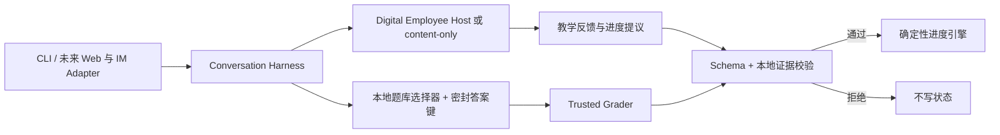

# 系统架构设计师过线私教

一个独立、可移植的本地数字老师：记得你真实做过什么，优先补最可能拖到 45 分以下的短板，并把每日任务压缩到最多 3 项。目标是稳定过线，不追求无止境刷高分。

> 当前状态：本地 Conversation Harness MVP。`content-only` 已支持连续对话、按进度选题、判分、写入进度与恢复会话；`agent-host` 可通过 Digital Employee 调用兼容的本地 Agent Host。多用户账号、云端同步和托管服务尚未实现。

本项目把两类公开能力组合起来：

- [senior-software-architect-review](https://github.com/PeterGuy326/senior-software-architect-review) 提供公开复习资料，由使用者单独 clone；
- [Digital Employee](https://github.com/fullstack-ai-infra/digital-employee) `0.3.0` 提供可移植员工包契约、静态校验与离线评测。

复习资料和私人进度彼此分离。公开资料可以更新和共享；个人档案、作答记录、错题证据始终保存在操作系统的用户数据目录中。

截至本项目建立时，上述复习资料仓库没有声明 LICENSE。本仓库因此不复制或再分发其中的题库、解析和范文，只接受用户自行提供的本地 clone。这里的 Apache-2.0 只覆盖本仓库代码和原创文档，不自动覆盖外部资料。详见 [来源说明](docs/PROVENANCE.md)。

## 已经能做什么

- `setup`：在仓库外建立本地私人档案与授权上下文；
- `status`：显示综合、案例、论文三科的真实证据状态；
- `today`：按过线优先算法给出最多 3 个任务；
- `doctor`：匿名时只做通用诊断，授权后才检查私人状态；
- `validate-package`：用 Digital Employee 做员工包静态校验；
- `eval-package`：运行员工包离线 fixture 评测，不调用模型；
- `session start/list/resume`：启动、列出或恢复交互式私人老师；不同渠道可拥有独立活动会话；
- `session turn --json`：带 revision、active-item 和 turn-id 防重放门禁，供自动化及后续 Web、钉钉、飞书 Adapter 复用；
- 从用户提供的历年题 Markdown 中按稳定考点精确选题，作答前隐藏答案；
- 用本地密封答案键确定性判分；`agent-host` 当前只能做协议一致性投影与 proposal-only 事件；
- 用 owner-only 会话文件保存题面与恢复点，不保存原始作答和受信授权；
- 严格验证智能体的进度提议，并只用本地可信作答证据写入确定性进度引擎。

旧的单轮 `run` 入口仍然关闭；连续对话统一走 `session` Harness。Digital Employee `0.3.0` 中 Codex 仍是 **probe-only**：可以探测兼容性，但 `agent-host` 会在模型运行前拒绝它。

## 快速开始

需要 Node.js 20+ 和 Python 3。

```bash
git clone https://github.com/PeterGuy326/senior-software-architect-review.git
git clone https://github.com/PeterGuy326/senior-architect-pass-coach.git
cd senior-architect-pass-coach
npm install

npm run coach -- setup \
  --content-dir ../senior-software-architect-review \
  --exam-date 2026-11-07 \
  --daily-minutes 45

npm run coach -- status --json
npm run coach -- today
npm run coach -- doctor

# 无需模型账号，直接进入连续对话
npm run coach -- session start \
  --mode content-only \
  --content-dir ../senior-software-architect-review
```

对话中可直接输入选项，也可以使用：

```text
/next       下一题
/answer B   作答，默认按“不确定”记录
/sure B     明确表示非常确定；只有这种答对证据才可直接判 mastered
/status     查看真实进度
/pause      保存并退出
/close      关闭并归档当前会话
```

只有一个活动会话时可直接恢复；存在多个会话时先列出，再用 `--session-id`：

```bash
npm run coach -- session list --json

npm run coach -- session resume \
  --content-dir ../senior-software-architect-review
```

机器调用使用同一套状态机，而不是另写一套业务逻辑：

```bash
npm run coach -- session start --mode content-only --json \
  --content-dir ../senior-software-architect-review

npm run coach -- session turn \
  --session-id SESSION_ID \
  --turn-id CHANNEL_DELIVERY_ID \
  --expected-revision REVISION_FROM_START \
  --intent next \
  --json \
  --content-dir ../senior-software-architect-review
```

`answer` 和 `advance` 还必须带上一轮返回的 `--expected-item-id`。同一 `turn-id` 的同一请求会返回已保存收据；同一 ID 换内容、过期 revision 或延迟题目都会被拒绝。

若进度提交开始后发生崩溃，该轮会终结为 `TURN_RESULT_INDETERMINATE`，绝不自动重跑。核对本地进度后可显式关闭并归档会话；即使原渠道 `turn-id` 已丢失，私人档案所有者也不会被困在活动会话中。

若本机已有 Digital Employee 兼容且具备凭证的 Host，可显式启用协议兼容性实验：

```bash
npm run coach -- session start \
  --mode agent-host \
  --engine qwen-code \
  --content-dir ../senior-software-architect-review
```

Harness 不依赖 Host 原生 session resume。每一轮仍是 one-shot，并重新注入当前题目和批准材料；CLI、未来 Web 和 IM 连接器因此能共享同一个会话事实来源。

当前 `agent-host` 严格限制模型只能回显受信题面和本地判定，因此主要用于验证 one-shot Host 协议，并未把生成式讲解作为产品能力开放。可见教学反馈仍来自受信题库解析；后续会在不松动判分字段的前提下增加独立的 coaching text。

用户首先看到的是员工自己的名称、欢迎语和发布者声明；Digital Employee 作为基础设施归属，Qwen/Claude/CodeBuddy 等仅作为可替换 engine 出现在运行信息中。当前品牌 sidecar 是本项目的先行约定，通用 package presentation 已反馈到上游 [Issue #102](https://github.com/fullstack-ai-infra/digital-employee/issues/102)。

如果不传 `--data-dir`，私人数据默认保存在：

- macOS：`~/Library/Application Support/senior-architect-pass-coach`
- Linux：`$XDG_DATA_HOME/senior-architect-pass-coach`，或 `~/.local/share/...`
- Windows：`%LOCALAPPDATA%/senior-architect-pass-coach`

Workbench 会拒绝把私人数据目录设在代码仓库内，即使该目录已经写进 `.gitignore`。

## 员工包检查

```bash
npm run coach -- validate-package
npm run coach -- eval-package

# 只探测 Codex 本机兼容性；不会调用模型
npm run coach -- validate-package --engine codex
```

静态校验与离线评测不会发起模型调用。安装 npm 依赖本身仍会访问配置的 npm registry。

## 信任边界



智能体永远只能“提议”。外层 Workbench 会先验证输出结构、授权范围和本地可信证据，再调用进度引擎写入。模型提供的用户身份、路径或“已经写入”声明一律不可信。

更完整的说明见 [架构](docs/ARCHITECTURE.md) 与 [隐私边界](docs/PRIVACY.md)。

## 开发

```bash
npm run check
```

本项目采用 [Apache License 2.0](LICENSE)。Digital Employee 是独立依赖，其归属见 [NOTICE](NOTICE)。
