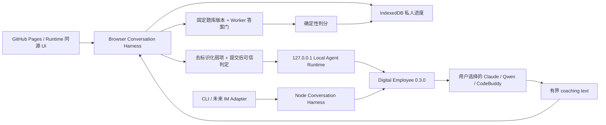

# 系统架构设计师过线私教

一个打开网页就能使用的私人数字老师：记得你真实做过什么，优先补最可能拖到 45 分以下的短板，并把每日任务压缩到最多 3 项。目标是稳定过线，不追求无止境刷高分。

## 直接使用

**[打开「架构过线私塾」](https://peterguy326.github.io/senior-architect-pass-coach/)**

基础私教不需要下载仓库、不需要安装 Node/Python、不需要编译，也不需要登录或填写 API Key。第一次打开时，老师会明确说明它还不知道你的进度；点击一次即可在当前浏览器建档并开始诊断。以后刷新或再次打开，会从这个浏览器已有的真实作答证据继续。

当前网页 MVP 先把最适合确定性闭环的**综合知识客观题**做好：每天最多 3 项，答对且明确“确定”才算掌握，猜对或不确定答对会进入复测。案例分析和论文会显示为“未测量”，不会假装已经支持。

> 当前状态：零安装 Web Chatbot 是永远可用的基础模式；增强模式由一次下载、无需源码编译的 Local Agent Runtime 同源打开同一页面。学习档案、选题、可信判分和进度仍由浏览器 Harness 统一保管，Digital Employee `0.3.0` 只把提交后的个性化讲解或自然语言追问交给用户选择的兼容 Agent。切换引擎不会换老师、不会清空进度。

## 使用本机 Agent 增强私教

如果你希望老师不仅判题，还能结合既往弱项追问、换一种方式解释和给出针对性的补救动作，可从 [Releases](https://github.com/PeterGuy326/senior-architect-pass-coach/releases) 下载对应系统的 **Local Agent Runtime**：

1. macOS 下载 Apple Silicon 或 Intel 的应用包，解压后打开“架构过线私教”；Linux x64（glibc 2.28+）解压后运行 `start-local-coach`。
2. Runtime 会在 `127.0.0.1` 打开同一套私教页面；点击页面顶部“连接本机 Agent”。
3. 从 Runtime 实际检查通过的引擎中选择一个。之后的可信判分先在浏览器本地完成，Agent 只负责个性化讲解。

这是“下载应用并打开”，不是 clone 仓库、安装 npm 依赖或本地编译。当前预览包尚未做 Apple notarization；ad-hoc 签名只用于完整性检查，不代表 Developer ID 或 Apple 背书。macOS 首次打开可先在 Finder 中右键选择“打开”；若仍被拦，请先尝试启动一次，再到“系统设置 → 隐私与安全 → 仍要打开”，详见 [Apple 官方说明](https://support.apple.com/102445)。公开 GitHub Pages 不会在加载时扫描本机端口；正式 Agent 路径由 Runtime 同源托管页面，因此不依赖公网页面跨域访问 localhost。

GitHub Pages 与 `127.0.0.1` 是两个浏览器 Origin，不能暗中互读 IndexedDB。已经在 Pages 学习的用户，第一次切到 Runtime 时请先在 Pages 点“导出”，再在 Runtime 页面点“导入”；之后在同一个 Runtime 页面切换任何 Agent 都不会丢档案。当前没有自动云同步，也不会假装两份档案已经合并。

Digital Employee 当前的真实兼容边界如下：

| 引擎 | 当前状态 | 说明 |
|---|---|---|
| Claude Code | 可运行 Adapter | 需要兼容版本和 Runtime 进程可见的 `ANTHROPIC_API_KEY` |
| Qwen Code | 可运行 Adapter | 需要 `0.17.1`、`OPENAI_API_KEY` 与 `OPENAI_MODEL` |
| CodeBuddy | 可运行 Adapter | 需要 `2.106.4`、`CODEBUDDY_API_KEY` 与 `CODEBUDDY_MODEL` |
| Qoder | 不兼容 | 当前 Adapter 不支持本员工包要求的结构化输出 |
| Codex | 仅探测 | Digital Employee `0.3.0` 尚无可运行 Adapter |

页面不会要求、接收或保存模型 API Key。首个预览版由 Runtime 启动时的本机环境提供对应服务凭证；框架 Adapter 不会冒充复用个人 CLI 登录态。已安装也不等于可用，页面只允许选择员工包级 preflight 通过的引擎。

本项目把两类公开能力组合起来：

- [senior-software-architect-review](https://github.com/PeterGuy326/senior-software-architect-review) 提供公开复习资料；网页会从固定审阅 commit 直接读取，考生无需 clone；
- [Digital Employee](https://github.com/fullstack-ai-infra/digital-employee) `0.3.0` 提供可移植员工包契约、静态校验与离线评测。

复习资料和私人进度彼此分离。网页端的个人档案与作答证据只保存在当前浏览器的 IndexedDB；CLI 端保存在操作系统的用户数据目录。两者默认都不上传。

截至本项目建立时，上述复习资料仓库没有声明 LICENSE。本仓库因此不把其中的题库、解析和范文复制进网页、npm 包或测试；网页只在用户浏览器运行时从固定来源读取，CLI 则读取用户自行取得的 clone。这里的 Apache-2.0 只覆盖本仓库代码和原创文档，不自动覆盖外部资料。详见 [来源说明](docs/PROVENANCE.md)。

## 已经能做什么

- 直接在浏览器聊天：输入“今天学什么”“查看进度”“继续”“出题”，或直接提交 A–H 单选/多选答案；连接 Runtime 后还可向所选 Agent 自然语言追问；
- 从固定公开 commit 读取综合客观题，作答前只展示题干与选项，提交后才返回可信答案和解析；
- 在浏览器本地原子保存档案、进度与无题文作答证据，支持刷新恢复、导出、导入和一键清除；
- 明确显示 45 分过线线、52 分安全目标、每日最多 3 项，以及综合/案例/论文的已测量边界；
- `setup`：在仓库外建立本地私人档案与授权上下文；
- `status`：显示综合、案例、论文三科的真实证据状态；
- `today`：按过线优先算法给出最多 3 个任务；
- `doctor`：匿名时只做通用诊断，授权后才检查私人状态；
- `validate-package`：用 Digital Employee 做员工包静态校验；
- `eval-package`：运行员工包离线 fixture 评测，不调用模型；
- `session start/list/resume`：启动、列出或恢复交互式私人老师；不同渠道可拥有独立活动会话；
- `session turn --json`：带 revision、active-item 和 turn-id 防重放门禁，供自动化及后续 Web、钉钉、飞书 Adapter 复用；
- 从用户提供的历年题 Markdown 中按稳定考点精确选题，作答前隐藏答案；
- 用本地密封答案键确定性判分；Agent 的讲解、自评或“已掌握”声明不能覆盖答案键或直接写进度；
- 用 owner-only 会话文件保存题面与恢复点，不保存原始作答和受信授权；
- 严格验证智能体的进度提议，并只用本地可信作答证据写入确定性进度引擎。

旧的单轮 `run` 入口仍然关闭；连续对话统一走 `session` Harness。Digital Employee `0.3.0` 中 Codex 仍是 **probe-only**：可以探测兼容性，但 `agent-host` 会在模型运行前拒绝它。

## 开发者与连接器本地运行

下面的安装步骤只用于开发、CLI 和未来钉钉/飞书连接器，不是考生使用网页的前置条件。需要仍在安全维护期内的 Node.js 22+ 和 Python 3。

```bash
git clone https://github.com/PeterGuy326/senior-software-architect-review.git
git clone https://github.com/PeterGuy326/senior-architect-pass-coach.git
cd senior-architect-pass-coach
npm install

npm run coach -- setup \
  --content-dir ../senior-software-architect-review \
  --exam-date 2026-11-07 \
  --daily-minutes 45

npm run coach -- status --json
npm run coach -- today
npm run coach -- doctor

# 无需模型账号，直接进入连续对话
npm run coach -- session start \
  --mode content-only \
  --content-dir ../senior-software-architect-review
```

对话中可直接输入选项，也可以使用：

```text
/next       下一题
/answer B   作答，默认按“不确定”记录
/sure B     明确表示非常确定；只有这种答对证据才可直接判 mastered
/status     查看真实进度
/pause      保存并退出
/close      关闭并归档当前会话
```

只有一个活动会话时可直接恢复；存在多个会话时先列出，再用 `--session-id`：

```bash
npm run coach -- session list --json

npm run coach -- session resume \
  --content-dir ../senior-software-architect-review
```

机器调用使用同一套状态机，而不是另写一套业务逻辑：

```bash
npm run coach -- session start --mode content-only --json \
  --content-dir ../senior-software-architect-review

npm run coach -- session turn \
  --session-id SESSION_ID \
  --turn-id CHANNEL_DELIVERY_ID \
  --expected-revision REVISION_FROM_START \
  --intent next \
  --json \
  --content-dir ../senior-software-architect-review
```

`answer` 和 `advance` 还必须带上一轮返回的 `--expected-item-id`。同一 `turn-id` 的同一请求会返回已保存收据；同一 ID 换内容、过期 revision 或延迟题目都会被拒绝。

若进度提交开始后发生崩溃，该轮会终结为 `TURN_RESULT_INDETERMINATE`，绝不自动重跑。核对本地进度后可显式关闭并归档会话；即使原渠道 `turn-id` 已丢失，私人档案所有者也不会被困在活动会话中。

若在开发环境中直接验证 CLI Agent Host，可显式启用：

```bash
npm run coach -- session start \
  --mode agent-host \
  --engine qwen-code \
  --content-dir ../senior-software-architect-review
```

CLI Harness 不依赖 Host 原生 session resume。每一轮仍是 one-shot，并重新注入当前题目和批准材料。当前零安装网页使用同一套教学规则的浏览器 `content-only` Adapter；未来 IM 连接器可以复用机器轮次契约。

Local Agent Runtime 采用 Hybrid Harness：出题阶段不调用模型；提交后先完成固定答案判定与浏览器进度事务，再把公开题面、可信判定和去标识化弱项摘要交给所选 Host，最终只投影有界的 `teaching_result.summary` 作为 coaching text。模型返回的推荐不会直接改排课，事件提案也不会由这个只读 Bridge 提交。

用户首先看到的是员工自己的名称、欢迎语和发布者声明；Digital Employee 作为基础设施归属，Qwen/Claude/CodeBuddy 等仅作为可替换 engine 出现在运行信息中。当前品牌 sidecar 是本项目的先行约定，通用 package presentation 已反馈到上游 [Issue #102](https://github.com/fullstack-ai-infra/digital-employee/issues/102)。

如果不传 `--data-dir`，私人数据默认保存在：

- macOS：`~/Library/Application Support/senior-architect-pass-coach`
- Linux：`$XDG_DATA_HOME/senior-architect-pass-coach`，或 `~/.local/share/...`
- Windows：`%LOCALAPPDATA%/senior-architect-pass-coach`

Workbench 会拒绝把私人数据目录设在代码仓库内，即使该目录已经写进 `.gitignore`。

## 员工包检查

```bash
npm run coach -- validate-package
npm run coach -- eval-package

# 只探测 Codex 本机兼容性；不会调用模型
npm run coach -- validate-package --engine codex
```

静态校验与离线评测不会发起模型调用。安装 npm 依赖本身仍会访问配置的 npm registry。

## 信任边界



智能体永远只能“提议”。外层 Workbench 会先验证输出结构、授权范围和本地可信证据，再调用进度引擎写入。模型提供的用户身份、路径或“已经写入”声明一律不可信。

更完整的说明见 [Local Agent Runtime](docs/LOCAL_RUNTIME.md)、[架构](docs/ARCHITECTURE.md) 与 [隐私边界](docs/PRIVACY.md)。

## 开发

```bash
npm run check
```

本项目采用 [Apache License 2.0](LICENSE)。Digital Employee 是独立依赖，其归属见 [NOTICE](NOTICE)。
